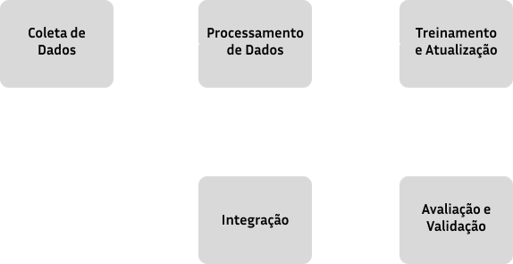

# Proposta de Aprendizado Contínuo em Sistemas Conversacionais
&emsp; O aprendizado contínuo é uma abordagem que permite a modelos de aprendizado de máquina aprender e adaptar-se a novas informações ao longo do tempo, sem esquecer o conhecimento previamente adquirido (Parisi et al., 2019). 

## Introdução
### Descrição do Problema
&emsp; Segundo Alonso et al. (2021), "a integração de técnicas de aprendizado contínuo é crucial para que os sistemas conversacionais permaneçam relevantes e eficazes na interação com os usuários em um ambiente dinâmico" (ALONSO et al., 2021). Dessa forma, os sistemas conversacionais, como chatbots e assistentes virtuais, enfrentam desafios significativos para se manterem atualizados com as mudanças no conhecimento e no comportamento do usuário.

### Justificativas
&emsp;  O paradigma de aprendizado contínuo nesse caso é essencial para garantir que esses sistemas possam adaptar-se e melhorar continuamente sem intervenção manual constante, oferecendo mais precisão e relevância nas interações com os usuários. Além disso, a capacidade de adaptação e atualização contínua é fundamental para a manutenção da relevância e eficácia de um sistema conversacional. A implementação de técnicas de aprendizado contínuo permite que os sistemas evoluam com base nas mudanças nas preferências dos usuários e nas novas informações disponíveis, garantindo uma experiência mais alinhada às necessidades e expectativas de quem irá utilizar e melhorando constantemente o desempenho do sistema ou produto como um todo.

## Solução Proposta
&emsp; A solução proposta para implementar o aprendizado contínuo em sistemas conversacionais envolve a criação de uma arquitetura dividida em módulos, facilitando a manutenção e permitindo a adaptação e melhoria constante do sistema.
A seguir será demonstrado o diagrama da arquitetura pensada e, em seguida, uma explicação mais detalhada da solução:

### Descrição dos Módulos
1. **Módulo de Coleta de Dados**: Responsável por capturar e armazenar interações dos usuários e dados relevantes.
2. **Módulo de Processamento de Dados**: Analisa e pré-processa os dados coletados para treinamento.
3. **Módulo de Treinamento e Atualização**: Utiliza os dados processados para treinar e atualizar o modelo de aprendizado.
4. **Módulo de Avaliação e Validação**: Avalia a performance do modelo atualizado e valida sua eficácia.
5. **Módulo de Integração**: Atualiza o sistema conversacional com o novo modelo treinado.

## Conclusão
&emsp; A implementação de uma abordagem de aprendizado contínuo permitirá que o sistema conversacional se adapte e evolua com o tempo, melhorando a interação com os usuários, o que garante, como produto, uma experiência mais personalizada e eficiente e um reflexo positivo do ponto de vista de negócios. O esforço necessário inclui o desenvolvimento e integração dos módulos propostos, bem como a manutenção frequente do sistema, o que de certo modo exige um investimento em profissionais especializados e recursos tecnológicos. A proposta visa garantir que o sistema permaneça relevante a longo prazo, sendo eficaz para sistemas que precisam estar sendo atualizados frequentemente.
&emsp; 

# Referências
Parisi, G. I., Kemker, R., part of, et al. (2019). Continual Learning: A Comparative Study on How to Defend Against Catastrophic Forgetting. Neural Networks.

ALONSO, J. M., PÉREZ, M. A., & MARTÍNEZ, E. F. Continuous Learning in Conversational Systems: Strategies and Challenges. Journal of Conversational AI, v. 5, n. 2, p. 89-104, 2021.
